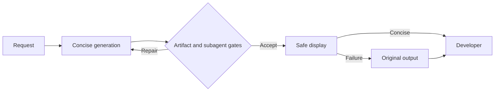

# Claudiator

Less AI prose. More signal.

Claudiator is a pre-release Claude Code plugin that reduces conversational and codebase verbosity while preserving correctness, warnings, uncertainty, commands, and meaningful comments.

It is not ready for marketplace publication. Publication is blocked until the locked holdout beats Default, Concise, and Ponytail under the protocol in [docs/BENCHMARK.md](docs/BENCHMARK.md).

## What it controls



- A forced output style removes routine preamble and narration.
- Prompt context selects the smallest useful representation and honors explicit depth.
- File-write hooks reject obvious comment bloat and a semantic hook judges broader over-engineering.
- Subagents receive a compact return contract and one repair opportunity.
- The local display renderer removes safely recognizable filler and enforces explicit single-action or command-plus-warning contracts without paraphrasing.
- An optional semantic renderer performs stronger display-only compression through the Anthropic API.

## Requirements

- Claude Code 2.1.258 or newer.
- Node.js 20 or newer on `PATH`.

No daemon runs. Claude Code invokes the bundled JavaScript process only when a hook fires.

## Local installation

```text
/plugin marketplace add /absolute/path/to/Claudiator
/plugin install claudiator@claudiator
```

For development:

```sh
claude --plugin-dir .
```

Start a new session or run `/clear` after changing the forced output style.

## Semantic renderer

Local mode is the default and makes no additional network request. Semantic display compression is opt-in through the plugin configuration UI:

| Setting | Default | Purpose |
|---|---:|---|
| `semantic_renderer` | `false` | Buffer and semantically compress complete assistant messages |
| `api_key` | empty | Anthropic API key stored through Claude Code's sensitive user configuration |
| `semantic_model` | `claude-haiku-4-5-20251001` | Compression model |

Semantic mode delays display until a complete assistant message is available. If compression fails or loses a protected string, Claudiator displays the complete original. The original transcript is never modified.

## Development

```sh
npm test
npm run benchmark:selftest
claude plugin validate --strict .
```

Run the low-cost training gate before opening its locked paraphrased holdout:

```sh
node benchmark/run.mjs --suite micro-train --arms default,claudiator --model haiku --runs 1 --max-cost-usd 0.25
```

Run the cheap native eval pilot:

```sh
claude plugin eval . --case 01-direct-command --runs 1 --ablation with-without --no-scaffold --no-publish --model haiku --max-cost-usd 0.50
```

See [docs/BENCHMARK.md](docs/BENCHMARK.md) for the controlled comparison, [docs/PREREGISTRATION.md](docs/PREREGISTRATION.md) for the marketplace gate, and the [first locked holdout report](docs/results/MICRO-HOLDOUT-2026-09-04.md) for current evidence.

## Privacy

Local metrics contain event names, character counts, and timings only. Prompts, responses, source code, file paths, and credentials are not logged. Semantic mode sends assistant text to Anthropic under the configured API account.

## Status

| Capability | Status |
|---|---|
| Plugin manifest and local marketplace | Implemented |
| Generation, artifact, subagent, and display hooks | Implemented |
| Protected-comment tests | Implemented |
| Native eval suite | Authored; native runner account-gated |
| Comparative corpus | 24 broad cases plus 18 micro training/holdout cases |
| Micro holdout | Failed 13/18; retired and reported transparently |
| Revised development gate | Claudiator 18/18; Default 9/18; Concise 10/18 |
| Independent holdout | Required before a superiority claim |
| Marketplace publication | Blocked |
