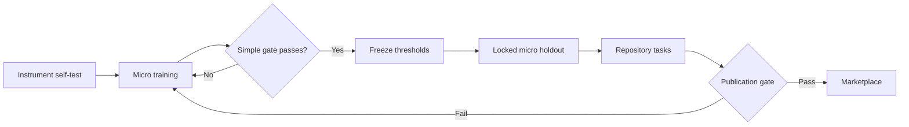

# Benchmark protocol

## Claim

With the same Claude Code build, primary model, task, tools, and starting repository, Claudiator reduces time-to-correct-comprehension and unnecessary artifacts without reducing correctness, safety, or requested depth.

## Arms

| Arm | Treatment |
|---|---|
| `default` | Claude Code without a plugin |
| `concise` | Built-in Concise output style |
| `yagni` | One-line concise/YAGNI instruction |
| `ponytail` | Ponytail plugin, coding subset only |
| `claudiator` | Full local Claudiator treatment |
| `claudiator-semantic` | Claudiator with opt-in semantic display compression |

Each cell runs in a fresh workspace. Authentication comes from the host Claude profile, while `--setting-sources project,local`, `--strict-mcp-config`, and `--disable-slash-commands` exclude user settings, MCP servers, skills, and installed plugins. Only the treatment passed with `--plugin-dir` loads; verify this in startup logs after Claude Code upgrades. Arm order is seeded and randomized. The harness records Claude's JSON result, Claudiator's raw and displayed messages, repository patch, token usage, cost, duration, and turns. Raw CLI output is retained for audit. Non-Claudiator arms use their CLI result for both raw and displayed output because they have no Claudiator display hook.

Benchmark capture contains task content and is enabled only inside the generated, gitignored run directory. It is separate from production telemetry.

## Scoring order

1. Correctness.
2. Safety and protected-information retention.
3. Blinded time-to-correct-comprehension.
4. Human-marked removable content eliminated.
5. Visible words and artifact bloat.
6. Tokens, cost, latency, and repair turns.

Never collapse these into one score. Report per-task medians, category macro-averages, and paired bootstrap 95% confidence intervals. The harness skips Ponytail outside coding, comment, and coding no-op cases; its all-cell summary is descriptive and must not be compared with broader arms.

## Workflow



## Budget-efficient micro gate

The micro gate tests six response shapes before spending money on application builds:

| Shape | Training | Locked holdout |
|---|---|---|
| Single command | `rg --files` | `git status --short` |
| Exact UI label | Delete account | Cancel upload |
| One-sentence definition | Idempotency | Cache stampede |
| Compact security action | API key | SSH private key |
| Necessary warning | `rm -rf` | `git clean -fd` |
| Requested depth | SQL injection | Mutex deadlock |

The holdout definition is protected by `benchmark/micro-holdout.sha256`. Do not inspect its results, tune Claudiator, and rerun it as though it remained a holdout. A product change after opening the holdout requires new independently authored holdout cases.

Run the native smoke suite:

```sh
claude plugin eval . --runs 1 --ablation with-without --no-scaffold --no-publish --model haiku --max-cost-usd 1
```

Run the comparative harness:

```sh
node benchmark/run.mjs --selftest
node benchmark/run.mjs --suite micro-train --arms default,claudiator --model haiku --runs 1 --max-cost-usd 0.25 --dry-run
node benchmark/run.mjs --suite micro-train --arms default,claudiator --model haiku --runs 1 --max-cost-usd 0.25
node benchmark/run.mjs --suite micro-train --arms default,concise,claudiator --model haiku --runs 3 --max-cost-usd 1
node benchmark/run.mjs --suite micro-holdout --arms default,concise,claudiator --model haiku --runs 3 --max-cost-usd 1
node benchmark/run.mjs --suite independent-holdout --arms default,concise,claudiator --model haiku --runs 3 --max-cost-usd 1.25
node benchmark/run.mjs --pilot --dry-run
node benchmark/run.mjs --pilot
node benchmark/run.mjs --arms default,concise,yagni,ponytail,claudiator --model haiku --runs 3 --max-cost-usd 5
```

All runs execute complete randomized Default/Claudiator pairs first, followed by other arms. Reports compare only matching case/run pairs; unmatched totals remain descriptive. The default reported-cost ceiling is `$0.50`; completing an active pair may exceed it by one call. Pass a lower ceiling to tighten it.

Resume a budget-limited run using the same model, arms, run count, and suite:

```sh
node benchmark/run.mjs --resume benchmark/runs/RUN_DIRECTORY --suite micro-train --arms default,concise,claudiator --model haiku --runs 3 --max-cost-usd 0.50
```

After the micro holdout passes, advance to small deterministic greenfield, brownfield, bug-fix, investigation, and no-op repository tasks. Full FastAPI or Express builds are demonstration-scale confirmation, not the first proof.

The first locked micro holdout did not pass and is retired. Its unchanged formal result is published in [results/MICRO-HOLDOUT-2026-09-04.md](results/MICRO-HOLDOUT-2026-09-04.md).

Subsequent evaluation uses separate content-correctness and presentation-compliance scores. Visible-word counts exclude Markdown fence markers, and equivalent answers are accepted only when declared before execution. These changes do not alter the retired holdout's formal score.

The revised six-case development suite passed 18/18 for Claudiator versus 9/18 for Default and 10/18 for Concise. See [results/MICRO-NEXT-TRAIN-2026-09-04.md](results/MICRO-NEXT-TRAIN-2026-09-04.md). A fresh independently authored holdout is still required.
